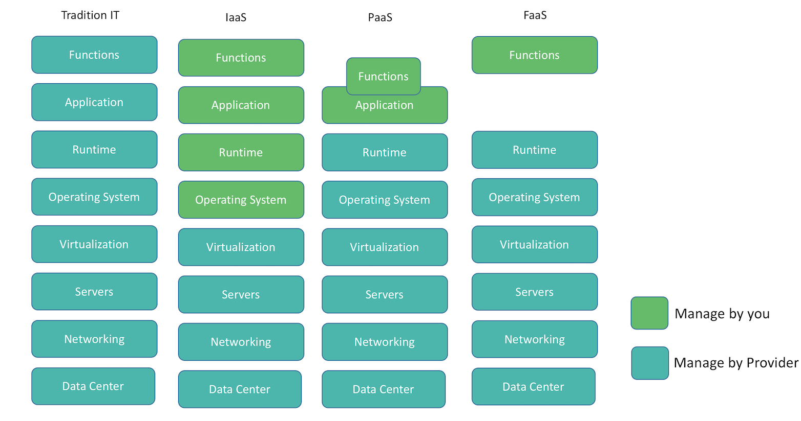

`Serverless` architecture allows you to run applications or services without having to manage infrastructure. It abstract the developers to think about servers, infrastructure, scaling, low level configuration. Serverless often associated with the `NoOps` movement and the concept also be referred to as Function as a Service or `FaaS`.  Serverless computing is an event driven application design and deployment paradigm where all the computing resources are provided as scalable cloud services.

> Though the name serverless suggest running code without servers, but it does not actually mean running code without servers. The name `serverless` is used because you don't owns the system, provision servers, install softwares and maintain it. It is completely managed by provided.

With serverless computing you write functions and then you can scale this independent functions automatically and you will be only charged for the duration it is running. Since we are writing functions instead of complete application we call it Function as a Service or `FaaS`. To better understand where it fit, lets discuss **few** popular way to deploy and manage your application:

- Traditional server setup where you install and manage yourself.
- Infrastructure as a Service (IaaS)
- Platform as a Service (Paas)
- Function as a Service (Faas)

They all run on servers, but the provider give different type of abstraction, which can be seen here:

As explain in the diagram, in Traditional way, you(or team) has to manage everything, in IaaS you are expected to start a virtual machines and do the installation and deploy the application. Whereas PaaS, you deploy codebase of an entire application to the cloud platform.
In FaaS, you don’t have to think of an entire application. You need to just write your function and test. Scaling, installation everything is taken care by Cloud Provider. Few of examples of these are:

Ways for managing servers | Examples
--- | ---
Infrastructure as a Service(IaaS) | *Amazon EC2, Azure VMs, Google Compute Engine*
Platform as a Service (PaaS)| *Heroku, Amazon Elastic Beanstalk*
Function as a Service (FaaS) | *AWS Lambda, Google Cloud Functions*
Back-ends as a Service(BaaS) | *Auth0 Authentication*
SaaS(SaaS) | *Dropbox, Slack*

> The key difference between PaaS and FaaS is in PaaS you deploy the complete application but in FaaS we write and deploy a function

## Benefits of using Serverless Architecture
Some of the benefits of serverless Architecture are:

#### No Servers to Manage:
No need to think about provisioning, installations, monitoring and OS patches. It reduced packaging and deployment complexity. No need of puppet, chef, shell scripts etc. Everything is managed by provider.

#### Continuous Scaling:
Before launching a application you have to think about scaling, with serverless no need to think about Scaling or downscale as it is automatically taken care by provider.

#### Green computing:
If you are managing your servers, you have to do pre planning based on concurrent user and decide how much capacity and servers you need and then provision them. And for most of cases these resource are un-utilized. In serverless you are actually just using servers when your code is running. That’s extraordinarily inefficient and a huge environmental impact. With a Serverless approach we no longer make such capacity decisions ourselves - we let the Serverless provider provision just enough server capacity for our needs in real time. This difference should lead to far more efficient use of resources across data centers and therefore to a reduced environmental impact compared with traditional capacity management approaches.

#### Pricing
You will be charged only for the time your function is running. You don't pay anything when your code isn't running. This is very economical.

## Current limitations with Serverless Architecture
Most of the provider claim 99.99%  availability, no servers to maintain sounds too good to be true, no need to think about scaling and its cheap, then you might be  think `Then why everyone is not using it`. Serverless is new concept unquestionably
it seems promising, but right now there are few limitations.

#### Ephemeral - Time Bound
Serverless methods are typically limited in how long each invocation is allowed to run by provider. For example at present AWS Lambda functions are not allowed to run for longer than 5 minutes and if they do they will be terminated. This is a important point to consider if you want to do long processing tasks.

#### Loss of Server optimizations
It goes without saying that not all applications can be implemented in the serverless way. There are limitations especially when it comes to legacy systems and using a public cloud.

#### No Disk Space and state
The lack of in-server disk and state of a functions have significant restrictions. For any invocation of a function none of the in-process disk and state will be available to any subsequent invocation. Once your serverless function has completed running, its state and disk is gone.

#### Evolving Ecosystem - This will improve with time
The whole serverless ecosystem like Deployment, packaging, versioning, debugging tool, design patterns etc need to improve.  All this thing will improve with time.

## Serverless Infrastructure Providers

These are few of the popular provider for serverless:

*  [AWS lamda](https://aws.amazon.com/lambda)
*  [Microsoft Azure Functions](https://azure.microsoft.com/en-in/services/functions/)
*  [Google Cloud Functions](https://cloud.google.com/functions/)
*  [IBM Openwhisk](https://developer.ibm.com/openwhisk/)

Few more popular ones are [Auth0 Webstask](https://webtask.io/), [Fission](http://fission.io/), [Weblab](https://weblab.io/)
[peer5](https://www.peer5.com/)

## What is the best use case to start with Serverless ?
Serverless is event based, ephemeral and has no Disk space. As of now you can't completely shift to serverless(unless you have very simple app). But you can start using this for small features/services, few of the good one to start with are:  
* Image resizing
* Email sending, subscriptions and newsletters
* Push notifications
* SMS sending
* Data Processing

## How to start ?
You can directly use the provider api's, but to speedup you can use any of these frameworks:
* [Serverless](https://github.com/serverless/serverless)
* [Apex](http://apex.run/)
* [Zappa](https://github.com/Miserlou/Zappa)
* [Chalice](https://github.com/awslabs/chalice)

I personally had good experience with [Serverless](https://github.com/serverless/serverless) it has good [documentation](https://serverless.com/framework/docs/) and support AWS, Azure and OpenWhisk.
To start with these are few [examples](https://github.com/serverless/examples)

## Conclusion
Serverless is not the correct approach for every problem, it will not replace other ways completely. But for things which are event based, serverless is very good options to use. Definitely Serverless Architecture is promising and will make developer life simple in future as more design patterns will involved.
