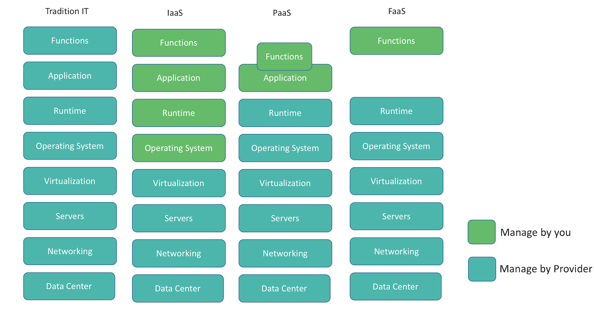

`Serverless` allows you to run applications or services without having to manage infrastructure. It abstract the developers to think about servers, infrastructure, scaling, low level configuration. Serverless often associated with the NoOps movement and the concept also be referred to as Function as a Service or `FaaS`.  Serverless computing is an event driven application design and deployment paradigm where all the computing resources are provided as scalable cloud services.

> Though the name suggest serverless, but it does not actually mean running code without servers. The name `serverless` is used because you don't owns the system, provision servers, install softwares and maintain it. It is completely managed by provided.

With serverless you can scale independent functions automatically and you will be only charged when your code is run.

To better understand where it fit, lets discuss **few** popular way to deploy and manage your application:

- Traditional way
- Infrastructure as a Service (IaaS)
- Platform as a Service (Paas)
- Function as a Service (Faas)

They all run on servers, but it provide different type of abstraction, which can be seen here:

As explain in the diagram, in Traditional way, you(or team) has to manage everything, in IaaS you are expected to start a virtual machines and do the installation and deploy the application. Whereas PaaS, you deploy codebase of an entire application to the cloud platform.
In FaaS, you don’t have to think of an entire application. You need to just write your function and test. Scaling, installation everything is taken care by Cloud Provider.
Few of examples of these are:

Ways | Examples
--- | ---
Infrastructure as a Service(IaaS) | *Amazon EC2, Azure VMs, Google Compute Engine*
Platform as a Service (Paas)| *Heroku, Amazon Elastic Beanstalk*
Function as a Service (Faas) | *AWS Lambda, Google Cloud Functions*
Back-ends as a Service(BaaS) | *Auth0 Autentiation*
SaaS(SaaS) | *Dropbox, Slack*

## Benefits
Some of the benefits of serverless are:

#### No Servers to Manage:
No need to think about provisioning, installations, monitoring and OS patches. It reduced packaging and deployment complexity. No need of puppet, chef, shell scripts etc. Everthing is managed by provider.

#### Continuous Scaling:
No think about Scaling or downscale as it is automatically taken care by provider.

#### Green computing:
If you are managing your servers, you have to do pre plan based on of concurrent user and most of the resource is un-utilized. In serverless you are actually use servers when your code is running. That’s extraordinarily inefficient and a huge environmental impact.
With a Serverless approach we no longer make such capacity decisions ourselves - we let the Serverless vendor provision just enough compute capacity for our needs in real time
This difference should lead to far more efficient use of resources across data centers and therefore to a reduced environmental impact compared with traditional capacity management approaches.

#### Pricing
You will charged only for the time your function is running. You don't pay anything when your code isn't running.

## Challenges
Most of the provider claim 99.99%  availability, no servers to maintain sounds too good to be true, no need to think about scaling and its cheap, then you might be  think `Then why everyone is not using it`

#### Ephemeral - Time Bound
Serverless methods are typically limited in how long each invocation is allowed to run. For example At present AWS Lambda functions are not allowed to run for longer than 5 minutes and if they do they will be terminated.

#### Loss of Server optimizations
It goes without saying that not all applications can be implemented in the serverless way. There are limitations especially when it comes to legacy systems and using a public cloud.

#### No Disk Space
The lack of in-server state for FaaS i
aaS functions have significant restrictions when it comes to local .. state. .. You should assume that for any given invocation of a function none of the in-process or host state that you create will be available to any subsequent invocation.

#### Ecosystem - This will improve with time
Right now it lack like Deployment, packaging, versioning, debugging tool, design patterns etc.  All this thing will improve with time.

## Serverless Infrastructure Providers

These are few of the popular provider for serverless:

*  [AWS lamda](https://aws.amazon.com/lambda)
*  [Microsoft Azure Functions](https://azure.microsoft.com/en-in/services/functions/)
*  [Google Cloud Functions](https://cloud.google.com/functions/)
*  [IBM Openwhisk](https://developer.ibm.com/openwhisk/)

Few more popular ones are [Auth0 Webstask](https://webtask.io/), [Fission](http://fission.io/), [Weblab](https://weblab.io/)
[peer5](https://www.peer5.com/)

## What is the best use case to start with serveless ?
Serverless is event based, Ephemeral and No Disk space. So as of now you can't completely shift to serverless(unless you have very simple app). These are few of the good features to start with:  
* Image resizing
* Email sending, subscriptions and newsletters
* Push notifications
* SMS sending
* Data Processing

## How to start ?
You can directly use the provider api's, but to speedup you can use any of few frameworks:
* [Serverless](https://github.com/serverless/serverless)
* [Apex](http://apex.run/)
* [Zappa](https://github.com/Miserlou/Zappa)
* [Chalice](https://github.com/awslabs/chalice)

I personally had good experience with [Serverless](https://github.com/serverless/serverless) it has good [documentation](https://serverless.com/framework/docs/) and  support AWS, Azure and OpenWhisk.
To start with these are few [examples](https://github.com/serverless/examples)

## Who is using Serverless?
